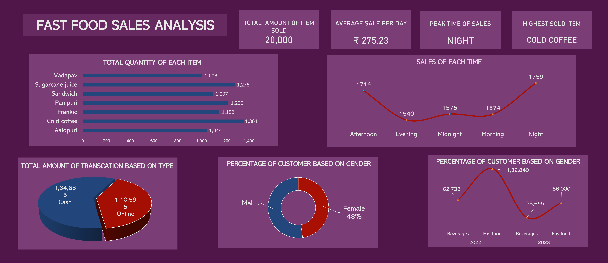

# FAST-FOOD-SALES-ANALYSIS

📈 Key Insights:

1. Total Items Sold: Discover how 20,000 items flew off the shelves!
2. Average Sales Per Day: ₹275.23—keeping those registers ringing daily.
3. Peak Sales Time: Evenings ruled as the prime time for sales.
4. Top-Selling Item: Cold Coffee emerged as the customer favorite.
5. Majority Transaction Mode: Cash transactions led the way over online.
6. Peak Business Year: 2022 saw fast food items outsell beverages.

🔍 Analysis Process:

1. Data Understanding: Explored and mapped out crucial dataset structures.
2. Data Preparation: Cleaned and processed data for robust analysis.
3. Visualization: Created insightful charts and dashboards for clear insights.
4. Report Insights: Translated data into actionable insights for business decisions.

🛠️ Tools Used: 
 
Microsoft Excel proved invaluable with Power Queries, Pivot Tables, formulas, and charts—plus, I crafted dynamic dashboards for easy visualization.
Stay tuned as I dive deeper into the trends shaping fast food sales and how these insights can drive smarter business strategies! 🚀

## Dashboard

